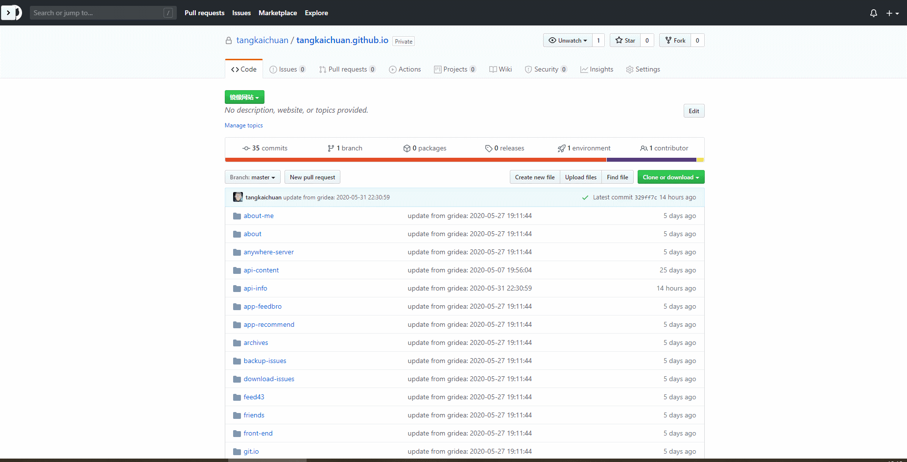

#  Network+

## DevTools for network recording, modification and resending.
 
1. Open the DevTools panel and find the tab with "Network+".
2. Make some HTTP request.
3. See the log of request and response.
4. Modify some fields like "Request Method", "URL" or "Request Payload"...
5. Click the "Send" button and notice the log.

    
